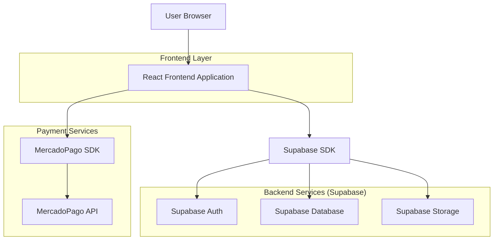
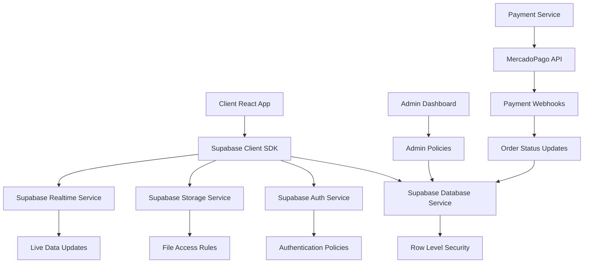
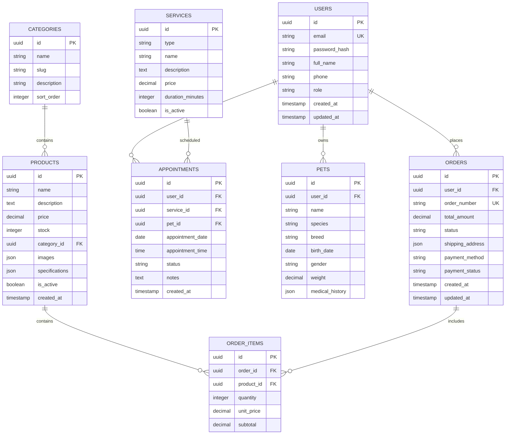

## 1. Architecture design



## 2. Technology Description

- **Frontend**: React@18 + tailwindcss@3 + vite
- **Initialization Tool**: vite-init
- **Backend**: Supabase (Backend-as-a-Service)
- **Database**: PostgreSQL (via Supabase)
- **Authentication**: Supabase Auth
- **File Storage**: Supabase Storage
- **Payment Processing**: MercadoPago SDK
- **UI Components**: HeadlessUI + Heroicons
- **State Management**: React Context + useReducer
- **Form Handling**: React Hook Form + Yup validation

## 3. Route definitions

| Route | Purpose |
|-------|---------|
| / | Página principal con hero, productos destacados y servicios |
| /productos | Catálogo completo de productos con filtros y búsqueda |
| /productos/:id | Detalle individual de producto con galería de imágenes |
| /carrito | Carrito de compras con resumen y opciones de cantidad |
| /checkout | Proceso de pago con formulario de envío y métodos de pago |
| /servicios/veterinaria | Información y agenda para servicios veterinarios |
| /servicios/peluqueria | Información y agenda para servicios de peluquería |
| /nosotros | Historia del negocio, equipo e instalaciones |
| /contacto | Formulario de contacto, mapa y horarios |
| /login | Página de autenticación para clientes y administradores |
| /registro | Formulario de registro para nuevos clientes |
| /admin/dashboard | Panel principal con métricas y resumen del negocio |
| /admin/productos | Gestión completa de productos (CRUD) |
| /admin/citas | Calendario y gestión de citas de servicios |
| /admin/reportes | Generación de reportes de ventas y servicios |
| /perfil | Perfil del usuario con historial de compras y citas |
| /mi-historial | Historial clínico digital de las mascotas |

## 4. API definitions

### 4.1 Productos API

```
GET /api/productos
```

Request Query Parameters:
| Param Name | Param Type | isRequired | Description |
|------------|-------------|-------------|-------------|
| categoria | string | false | Filtrar por categoría de producto |
| search | string | false | Búsqueda por nombre o descripción |
| precio_min | number | false | Precio mínimo del filtro |
| precio_max | number | false | Precio máximo del filtro |
| ordenar | string | false | Ordenar por: 'precio_asc', 'precio_desc', 'nombre' |
| pagina | number | false | Número de página para paginación |
| limite | number | false | Cantidad de productos por página |

Response:
```json
{
  "productos": [
    {
      "id": "uuid",
      "nombre": "Alimento Premium Perro Adulto",
      "descripcion": "Alimento balanceado para perros adultos",
      "precio": 12500,
      "stock": 25,
      "categoria": "alimentos",
      "imagenes": ["url1", "url2"],
      "especificaciones": {"peso": "15kg", "marca": "PremiumPet"}
    }
  ],
  "total": 150,
  "pagina": 1,
  "total_paginas": 15
}
```

### 4.2 Carrito API

```
POST /api/carrito/agregar
```

Request:
| Param Name | Param Type | isRequired | Description |
|------------|-------------|-------------|-------------|
| producto_id | string | true | ID del producto a agregar |
| cantidad | number | true | Cantidad de unidades |

Response:
```json
{
  "carrito_id": "uuid",
  "items": [
    {
      "producto_id": "uuid",
      "nombre": "Producto",
      "precio": 12500,
      "cantidad": 2,
      "subtotal": 25000
    }
  ],
  "total": 25000
}
```

### 4.3 Citas API

```
POST /api/citas/reservar
```

Request:
| Param Name | Param Type | isRequired | Description |
|------------|-------------|-------------|-------------|
| servicio_tipo | string | true | 'veterinaria' o 'peluqueria' |
| fecha | string | true | Fecha en formato ISO |
| hora | string | true | Hora en formato HH:MM |
| mascota_nombre | string | true | Nombre de la mascota |
| mascota_tipo | string | true | Tipo de mascota |
| cliente_nombre | string | true | Nombre del cliente |
| cliente_telefono | string | true | Teléfono de contacto |
| cliente_email | string | true | Email para confirmación |

Response:
```json
{
  "cita_id": "uuid",
  "fecha": "2024-01-15",
  "hora": "14:30",
  "servicio": "veterinaria",
  "estado": "confirmada",
  "mensaje_confirmacion": "Cita confirmada para el 15/01/2024 a las 14:30"
}
```

### 4.4 Pagos API

```
POST /api/pagos/procesar
```

Request:
| Param Name | Param Type | isRequired | Description |
|------------|-------------|-------------|-------------|
| carrito_id | string | true | ID del carrito de compras |
| metodo_pago | string | true | 'mercadopago' o 'efectivo' |
| direccion_envio | object | true | Datos completos de dirección |
| cliente_datos | object | true | Nombre, email, teléfono del cliente |

Response:
```json
{
  "pago_id": "uuid",
  "estado": "aprobado",
  "orden_id": "ORD-2024-001",
  "preferencia_pago": {
    "init_point": "https://mercadopago.com/checkout/...",
    "preference_id": "pref_123"
  }
}
```

## 5. Server architecture diagram



## 6. Data model

### 6.1 Data model definition



### 6.2 Data Definition Language

**Users Table (users)**
```sql
-- create table
CREATE TABLE users (
    id UUID PRIMARY KEY DEFAULT gen_random_uuid(),
    email VARCHAR(255) UNIQUE NOT NULL,
    password_hash VARCHAR(255) NOT NULL,
    full_name VARCHAR(255) NOT NULL,
    phone VARCHAR(50),
    role VARCHAR(20) DEFAULT 'customer' CHECK (role IN ('customer', 'admin', 'veterinarian', 'groomer')),
    created_at TIMESTAMP WITH TIME ZONE DEFAULT NOW(),
    updated_at TIMESTAMP WITH TIME ZONE DEFAULT NOW()
);

-- create index
CREATE INDEX idx_users_email ON users(email);
CREATE INDEX idx_users_role ON users(role);

-- RLS policies
ALTER TABLE users ENABLE ROW LEVEL SECURITY;

-- Users can read their own data
CREATE POLICY "Users can view own profile" ON users
    FOR SELECT USING (auth.uid() = id);

-- Users can update their own data
CREATE POLICY "Users can update own profile" ON users
    FOR UPDATE USING (auth.uid() = id);

-- Admins can manage all users
CREATE POLICY "Admins can manage all users" ON users
    FOR ALL USING (
        EXISTS (
            SELECT 1 FROM users
            WHERE id = auth.uid()
            AND role = 'admin'
        )
    );
```

**Products Table (products)**
```sql
-- create table
CREATE TABLE products (
    id UUID PRIMARY KEY DEFAULT gen_random_uuid(),
    name VARCHAR(255) NOT NULL,
    description TEXT,
    price DECIMAL(10,2) NOT NULL CHECK (price >= 0),
    stock INTEGER DEFAULT 0 CHECK (stock >= 0),
    category_id UUID REFERENCES categories(id),
    images JSONB DEFAULT '[]',
    specifications JSONB DEFAULT '{}',
    is_active BOOLEAN DEFAULT true,
    created_at TIMESTAMP WITH TIME ZONE DEFAULT NOW(),
    updated_at TIMESTAMP WITH TIME ZONE DEFAULT NOW()
);

-- create index
CREATE INDEX idx_products_category ON products(category_id);
CREATE INDEX idx_products_active ON products(is_active);
CREATE INDEX idx_products_name ON products(name);

-- RLS policies
ALTER TABLE products ENABLE ROW LEVEL SECURITY;

-- Public can view active products
CREATE POLICY "Public can view active products" ON products
    FOR SELECT USING (is_active = true);

-- Admins can manage products
CREATE POLICY "Admins can manage products" ON products
    FOR ALL USING (
        EXISTS (
            SELECT 1 FROM users
            WHERE id = auth.uid()
            AND role = 'admin'
        )
    );
```

**Categories Table (categories)**
```sql
-- create table
CREATE TABLE categories (
    id UUID PRIMARY KEY DEFAULT gen_random_uuid(),
    name VARCHAR(100) NOT NULL,
    slug VARCHAR(100) UNIQUE NOT NULL,
    description TEXT,
    sort_order INTEGER DEFAULT 0,
    created_at TIMESTAMP WITH TIME ZONE DEFAULT NOW()
);

-- insert initial data
INSERT INTO categories (name, slug, description, sort_order) VALUES
    ('Alimentos', 'alimentos', 'Alimentos balanceados y snacks para mascotas', 1),
    ('Accesorios', 'accesorios', 'Collares, correas, juguetes y más', 2),
    ('Medicamentos', 'medicamentos', 'Productos veterinarios y medicinas', 3),
    ('Higiene', 'higiene', 'Shampoo, cepillos y productos de limpieza', 4);
```

**Orders Table (orders)**
```sql
-- create table
CREATE TABLE orders (
    id UUID PRIMARY KEY DEFAULT gen_random_uuid(),
    user_id UUID REFERENCES users(id),
    order_number VARCHAR(20) UNIQUE NOT NULL,
    total_amount DECIMAL(10,2) NOT NULL CHECK (total_amount >= 0),
    status VARCHAR(20) DEFAULT 'pending' CHECK (status IN ('pending', 'confirmed', 'shipped', 'delivered', 'cancelled')),
    shipping_address JSONB NOT NULL,
    payment_method VARCHAR(50) NOT NULL,
    payment_status VARCHAR(50) DEFAULT 'pending',
    created_at TIMESTAMP WITH TIME ZONE DEFAULT NOW(),
    updated_at TIMESTAMP WITH TIME ZONE DEFAULT NOW()
);

-- create index
CREATE INDEX idx_orders_user ON orders(user_id);
CREATE INDEX idx_orders_status ON orders(status);
CREATE INDEX idx_orders_created ON orders(created_at DESC);

-- RLS policies
ALTER TABLE orders ENABLE ROW LEVEL SECURITY;

-- Users can view their own orders
CREATE POLICY "Users can view own orders" ON orders
    FOR SELECT USING (user_id = auth.uid());

-- Admins can view all orders
CREATE POLICY "Admins can manage all orders" ON orders
    FOR ALL USING (
        EXISTS (
            SELECT 1 FROM users
            WHERE id = auth.uid()
            AND role = 'admin'
        )
    );
```

**Services Table (services)**
```sql
-- create table
CREATE TABLE services (
    id UUID PRIMARY KEY DEFAULT gen_random_uuid(),
    type VARCHAR(50) NOT NULL CHECK (type IN ('veterinary', 'grooming')),
    name VARCHAR(255) NOT NULL,
    description TEXT,
    price DECIMAL(10,2) NOT NULL,
    duration_minutes INTEGER NOT NULL,
    is_active BOOLEAN DEFAULT true,
    created_at TIMESTAMP WITH TIME ZONE DEFAULT NOW()
);

-- insert initial services
INSERT INTO services (type, name, description, price, duration_minutes) VALUES
    ('veterinary', 'Consulta General', 'Revisión completa de salud general', 2500, 30),
    ('veterinary', 'Vacunación', 'Aplicación de vacunas correspondientes', 1800, 15),
    ('grooming', 'Baño y Corte Pequeño', 'Baño completo y corte de pelo para mascotas pequeñas', 3500, 90),
    ('grooming', 'Baño y Corte Grande', 'Baño completo y corte de pelo para mascotas grandes', 4500, 120);
```

**Appointments Table (appointments)**
```sql
-- create table
CREATE TABLE appointments (
    id UUID PRIMARY KEY DEFAULT gen_random_uuid(),
    user_id UUID REFERENCES users(id),
    service_id UUID REFERENCES services(id),
    pet_id UUID REFERENCES pets(id),
    appointment_date DATE NOT NULL,
    appointment_time TIME NOT NULL,
    status VARCHAR(20) DEFAULT 'scheduled' CHECK (status IN ('scheduled', 'confirmed', 'completed', 'cancelled')),
    notes TEXT,
    created_at TIMESTAMP WITH TIME ZONE DEFAULT NOW(),
    updated_at TIMESTAMP WITH TIME ZONE DEFAULT NOW()
);

-- create index
CREATE INDEX idx_appointments_user ON appointments(user_id);
CREATE INDEX idx_appointments_date ON appointments(appointment_date);
CREATE INDEX idx_appointments_time ON appointments(appointment_time);

-- RLS policies
ALTER TABLE appointments ENABLE ROW LEVEL SECURITY;

-- Users can manage their own appointments
CREATE POLICY "Users can manage own appointments" ON appointments
    FOR ALL USING (user_id = auth.uid());

-- Admins can manage all appointments
CREATE POLICY "Admins can manage all appointments" ON appointments
    FOR ALL USING (
        EXISTS (
            SELECT 1 FROM users
            WHERE id = auth.uid()
            AND role IN ('admin', 'veterinarian', 'groomer')
        )
    );
```

**Pets Table (pets)**
```sql
-- create table
CREATE TABLE pets (
    id UUID PRIMARY KEY DEFAULT gen_random_uuid(),
    user_id UUID REFERENCES users(id),
    name VARCHAR(100) NOT NULL,
    species VARCHAR(50) NOT NULL,
    breed VARCHAR(100),
    birth_date DATE,
    gender VARCHAR(10) CHECK (gender IN ('male', 'female')),
    weight DECIMAL(5,2),
    medical_history JSONB DEFAULT '[]',
    created_at TIMESTAMP WITH TIME ZONE DEFAULT NOW(),
    updated_at TIMESTAMP WITH TIME ZONE DEFAULT NOW()
);

-- create index
CREATE INDEX idx_pets_user ON pets(user_id);
CREATE INDEX idx_pets_species ON pets(species);

-- RLS policies
ALTER TABLE pets ENABLE ROW LEVEL SECURITY;

-- Users can manage their own pets
CREATE POLICY "Users can manage own pets" ON pets
    FOR ALL USING (user_id = auth.uid());
```

**Grant permissions for public access**
```sql
-- Grant basic read access to public/anonymous users
GRANT SELECT ON categories TO anon;
GRANT SELECT ON products TO anon;
GRANT SELECT ON services TO anon;

-- Grant full access to authenticated users
GRANT ALL PRIVILEGES ON ALL TABLES TO authenticated;
GRANT ALL PRIVILEGES ON ALL SEQUENCES TO authenticated;
```