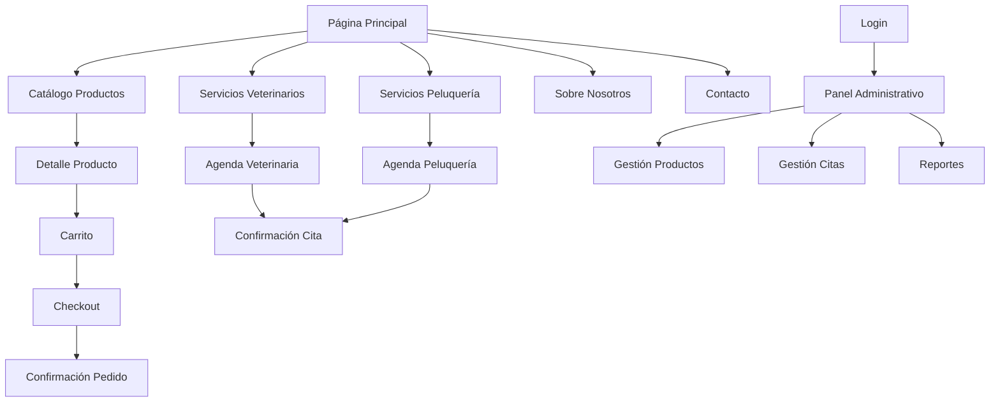

## 1. Product Overview
Sitio web completo para "Pedro y Juan", negocio de San Nicolás de los Arroyos especializado en venta de animales, productos para mascotas, servicios veterinarios y peluquería animal.

El sitio digitalizará los procesos actuales del negocio, facilitando la venta online de productos, gestión de citas para servicios profesionales y administración integral del negocio.

## 2. Core Features

### 2.1 User Roles
| Role | Registration Method | Core Permissions |
|------|---------------------|------------------|
| Cliente Final | Email o redes sociales | Navegar catálogo, comprar productos, reservar servicios, ver historial |
| Veterinario/Peluquero | Registro administrativo | Gestionar agenda, ver citas asignadas, actualizar historial clínico |
| Administrador | Registro exclusivo | Gestionar productos, servicios, reportes, usuarios, configuración general |

### 2.2 Feature Module
El sitio web de Pedro y Juan consta de las siguientes páginas principales:

1. **Página Principal**: Hero con servicios destacados, catálogo de productos, información de contacto y horarios.
2. **Catálogo de Productos**: Navegación por categorías, filtros avanzados, vista de detalles y carrito de compras.
3. **Checkout**: Proceso de pago seguro, formulario de envío, confirmación de pedido.
4. **Servicios Veterinarios**: Información de servicios, agenda online, formulario de reserva.
5. **Servicios de Peluquería**: Galería de trabajos, precios, agenda de turnos.
6. **Sobre Nosotros**: Historia del negocio, equipo, instalaciones.
7. **Contacto**: Ubicación con mapa interactivo, formulario de contacto, horarios.
8. **Panel Administrativo**: Dashboard con métricas, gestión de productos, citas, reportes.
9. **Login/Registro**: Acceso seguro para clientes y personal del negocio.

### 2.3 Page Details
| Page Name | Module Name | Feature description |
|-----------|-------------|---------------------|
| Página Principal | Hero Section | Carrusel de imágenes con servicios destacados, botones de acción principal para catálogo y servicios. |
| Página Principal | Productos Destacados | Grid responsive con productos más vendidos, precios y botón "Agregar al carrito". |
| Página Principal | Servicios | Cards informativas de veterinaria y peluquería con link a reservas. |
| Página Principal | Información de Contacto | Horarios, dirección, teléfono y botón para WhatsApp directo. |
| Catálogo de Productos | Navegación por Categorías | Menú lateral con categorías: alimentos, accesorios, medicamentos, juguetes. |
| Catálogo de Productos | Búsqueda y Filtros | Barra de búsqueda, filtros por precio, marca, tamaño de mascota. |
| Catálogo de Productos | Grid de Productos | Cards con imagen, nombre, precio, stock disponible, botón de acción rápida. |
| Catálogo de Productos | Detalle de Producto | Galería de imágenes, descripción completa, especificaciones, reviews de clientes. |
| Carrito de Compras | Resumen de Compra | Lista de productos agregados, cantidad editable, precio total, botón de checkout. |
| Checkout | Formulario de Envío | Campos para dirección, teléfono, instrucciones especiales de entrega. |
| Checkout | Método de Pago | Integración con pasarela de pagos local (MercadoPago), opción de pago en efectivo. |
| Checkout | Confirmación | Resumen del pedido, número de orden, instrucciones de seguimiento. |
| Servicios Veterinarios | Información de Servicios | Descripción de cada servicio, duración aproximada, precios. |
| Servicios Veterinarios | Agenda Online | Calendario interactivo con disponibilidad, selección de horario, formulario de datos de la mascota. |
| Servicios Veterinarios | Confirmación de Cita | Detalles del turno reservado, recordatorio por email/WhatsApp. |
| Servicios de Peluquería | Galería de Trabajos | Antes y después de cortes de pelo, diferentes razas y estilos. |
| Servicios de Peluquería | Precios y Paquetes | Tabla de precios por tamaño de mascota, servicios incluidos. |
| Servicios de Peluquería | Reserva de Turno | Formulario con tipo de servicio, tamaño de mascota, preferencia de horario. |
| Sobre Nosotros | Historia del Negocio | Timeline visual con hitos importantes, fundadores, evolución del negocio. |
| Sobre Nosotros | Equipo | Fotos y descripción del personal veterinario y de peluquería. |
| Sobre Nosotros | Instalaciones | Galería de fotos de las instalaciones del negocio. |
| Contacto | Mapa Interactivo | Mapa de Google Maps con marcador de ubicación exacta. |
| Contacto | Formulario de Contacto | Campos para nombre, email, teléfono, mensaje, checkbox para newsletter. |
| Contacto | Horarios y Datos | Horario de atención completo, teléfonos, redes sociales. |
| Panel Administrativo | Dashboard | Métricas de ventas del día/mes, citas programadas, productos con bajo stock. |
| Panel Administrativo | Gestión de Productos | CRUD completo de productos, gestión de inventario, actualización de precios. |
| Panel Administrativo | Gestión de Citas | Vista de calendario con todas las citas, confirmación/cancelación, reasignación. |
| Panel Administrativo | Reportes | Ventas por período, productos más vendidos, servicios más solicitados. |
| Panel Administrativo | Notificaciones | Sistema de notificaciones automáticas para confirmaciones de citas y pedidos. |
| Login/Registro | Formulario de Acceso | Email y contraseña, opción de "Recordarme", link a recuperación de contraseña. |
| Login/Registro | Registro de Nuevo Cliente | Formulario con datos básicos, aceptación de términos y condiciones. |

## 3. Core Process

### Flujo de Compra para Cliente
1. Usuario navega por el catálogo y agrega productos al carrito
2. Revisa el carrito y procede al checkout
3. Completa información de envío y selecciona método de pago
4. Realiza el pago a través de la pasarela segura
5. Recibe confirmación del pedido con número de seguimiento
6. Recibe notificaciones de estado del envío

### Flujo de Reserva de Servicios
1. Usuario selecciona servicio deseado (veterinaria o peluquería)
2. Visualiza disponibilidad en el calendario interactivo
3. Selecciona fecha y horario preferido
4. Completa información de la mascota y datos de contacto
5. Confirma la reserva
6. Recibe confirmación por email/WhatsApp con detalles del turno

### Flujo Administrativo
1. Administrador accede al panel con credenciales seguras
2. Gestiona inventario actualizando stock de productos
3. Revisa y confirma citas programadas
4. Genera reportes de ventas y servicios
5. Envía notificaciones automáticas a clientes
6. Actualiza información del negocio y servicios

## 4. User Interface Design

### 4.1 Design Style
- **Colores Primarios**: Verde #2E8B57 (confianza, naturaleza), Blanco #FFFFFF (limpieza)
- **Colores Secundarios**: Naranja #FF6B35 (amigable, energético), Gris #F5F5F5 (fondo)
- **Estilo de Botones**: Rounded corners (8px), sombra sutil, efecto hover con cambio de color
- **Tipografía**: Inter para headers, Open Sans para body text
- **Tamaños de Fuente**: Headers 32-24px, Body 16px, Small text 14px
- **Estilo de Layout**: Card-based design con espaciado generoso (16-24px)
- **Iconos**: Estilo lineal consistente, preferencia por iconos de animales y veterinaria

### 4.2 Page Design Overview
| Page Name | Module Name | UI Elements |
|-----------|-------------|-------------|
| Página Principal | Hero Section | Imagen de fondo de mascotas felices, overlay semitransparente, título principal en blanco, CTA buttons con color naranja |
| Página Principal | Productos Destacados | Cards con borde sutil, imagen de producto centrada, precio destacado en verde, botón de acción naranja |
| Catálogo de Productos | Grid de Productos | Layout responsive 4 columnas desktop, 2 tablet, 1 móvil, paginación al final, filtros sticky lateral |
| Servicios | Agenda Online | Calendario mensual con días disponibles en verde, ocupados en gris, selector de horario horizontal |
| Panel Administrativo | Dashboard | Cards de métricas con iconos, gráficos de líneas para ventas, tabla de productos con bajo stock |

### 4.3 Responsiveness
- **Mobile-First**: Diseño optimizado para dispositivos móviles primero
- **Breakpoints**: 320px (móvil), 768px (tablet), 1024px (desktop)
- **Touch Optimization**: Botones mínimo 44x44px, espaciado generoso entre elementos clickeables
- **Menú Responsive**: Hamburguer menu en móvil, navegación horizontal en desktop

### 4.4 Interacciones y Animaciones
- **Scroll Animations**: Fade in suave al hacer scroll hacia elementos
- **Hover Effects**: Elevación de cards, cambio de color en botones, zoom sutil en imágenes
- **Loading States**: Skeleton screens durante carga de productos
- **Transitions**: Transiciones de 0.3s ease-in-out para todos